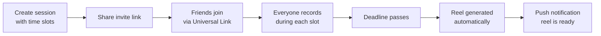
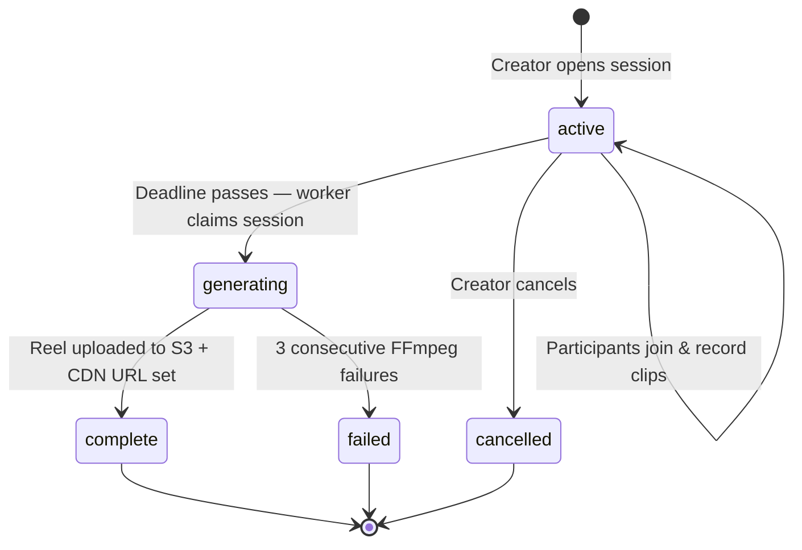
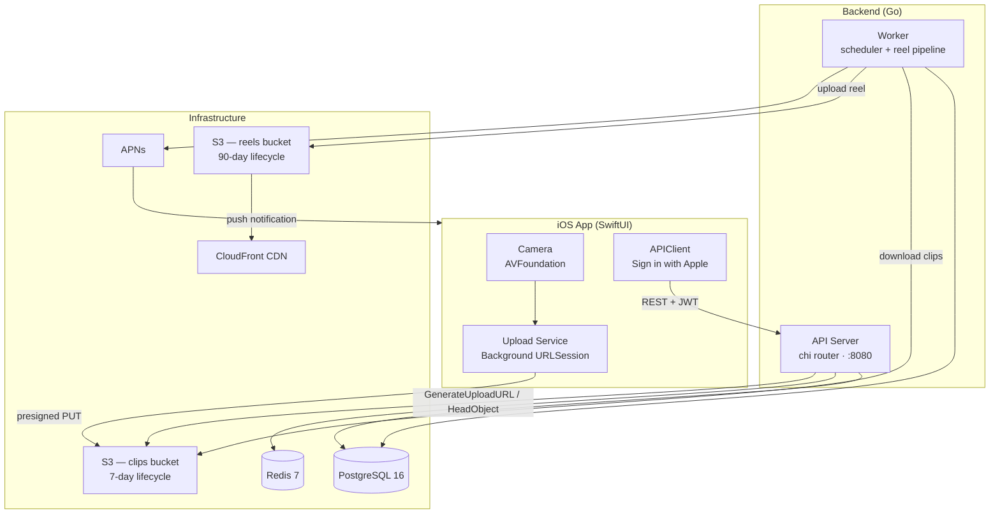
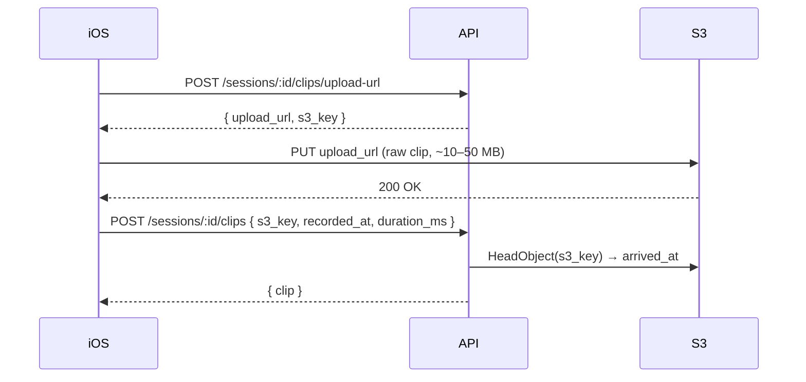
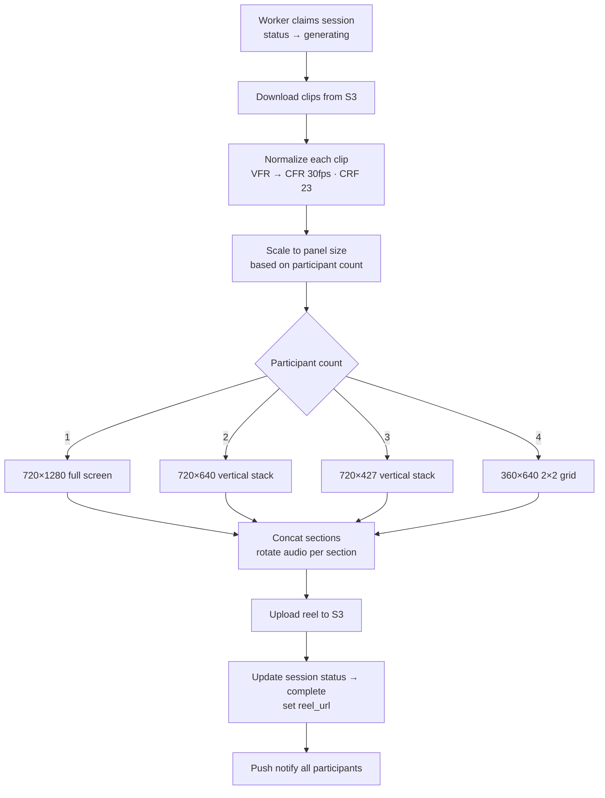

# Velo

Velo is an iOS app where a group of friends (up to 4) records short clips throughout the day and receives an auto-generated split-screen reel when the session ends.

---

## How it works

Friends create a **session** with named time slots — Morning, Midday, Evening, etc. — and a deadline. Each person records a clip during each slot from their own phone. When the deadline hits, Velo stitches everyone's clips together into a portrait split-screen reel and sends it to the group.



---

## Session lifecycle



---

## Architecture



---

## Upload flow

The iOS app never uploads through the API server. It gets a short-lived presigned URL and pushes directly to S3, then confirms with the API.



If confirmation fails (network drop, app killed), the app persists the pending clip in CoreData and retries on next launch. The backend deduplicates by `s3_key`.

---

## Reel generation

When the session deadline passes, the worker claims the session and runs a multi-pass FFmpeg pipeline.



---

## Tech stack

| Layer | Technology |
|---|---|
| iOS | SwiftUI · AVFoundation · Background URLSession · Sign in with Apple · CoreData |
| API server | Go · chi · pgx/v5 · golang-jwt |
| Worker | Go · FFmpeg (multi-pass via exec) |
| Database | PostgreSQL 16 |
| Cache / blocklist | Redis 7 |
| File storage | AWS S3 |
| Reel delivery | CloudFront CDN |
| Push notifications | APNs (sideshow/apns2) |
| Infrastructure | Docker Compose · EC2 t3.large (MVP) |

---

## Local development

### Prerequisites

- Go 1.22+
- Docker + Docker Compose
- `ffmpeg` (`brew install ffmpeg`)
- `golang-migrate` CLI (`brew install golang-migrate`)
- `golangci-lint` (for linting)

### Setup

```bash
# 1. Start Postgres (and optionally Redis)
docker compose up -d
docker compose --profile redis up -d   # add Redis for token blocklist

# 2. Copy and fill in env
cp server/.env.example server/.env
# Edit .env — set JWT_SECRET, APPLE_APP_ID, and AWS credentials

# 3. Run the API server (auto-migrates on startup)
cd server
make run
```

---

## Make commands

All commands run from `server/`.

| Command | Description |
|---|---|
| `make build` | Compile `api` and `worker` binaries |
| `make run` | Build and start the API server locally |
| `make test` | Run all tests (unit + integration) |
| `make lint` | Run golangci-lint |
| `make docker-build` | Build the Docker image |
| `make docker-up` | Start all services with Docker Compose |
| `make docker-down` | Stop and remove containers |
| `make migrate-up` | Apply all pending migrations |
| `make migrate-down` | Roll back the last migration |

---

## Project structure

```
velo/
├── server/
│   ├── cmd/api/          # API server entrypoint
│   ├── cmd/worker/       # Reel worker entrypoint (one-shot, triggered every 5 min)
│   ├── internal/
│   │   ├── auth/         # Apple identity token validation, JWT, token blocklist
│   │   ├── domain/       # Core types: User, Session, Slot, Clip
│   │   ├── handler/      # HTTP handlers
│   │   ├── middleware/   # Auth, logger
│   │   ├── reel/         # Alignment algorithm, scheduler, reel service
│   │   ├── ffmpeg/       # FFmpeg multi-pass pipeline
│   │   ├── storage/      # S3 interface + in-memory stub
│   │   ├── queue/        # Redis job queue
│   │   └── testutil/     # Shared test helpers (testcontainers + fixtures)
│   ├── migrations/       # SQL migrations (golang-migrate)
│   ├── Dockerfile
│   └── docker-compose.yml
└── swifty/               # iOS app (SwiftUI)
```
