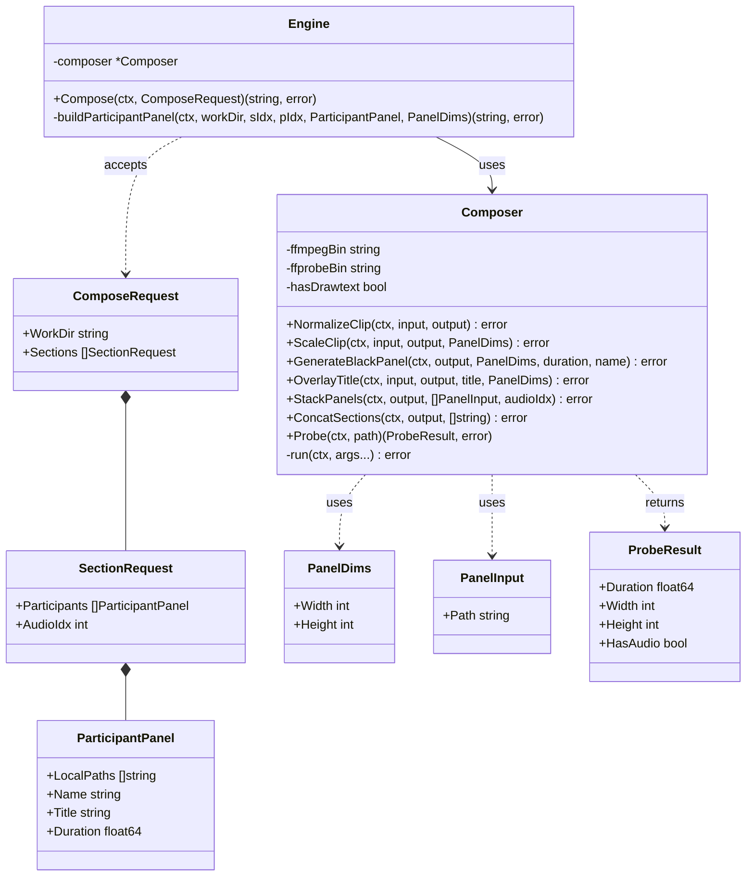
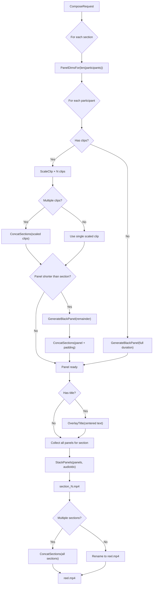
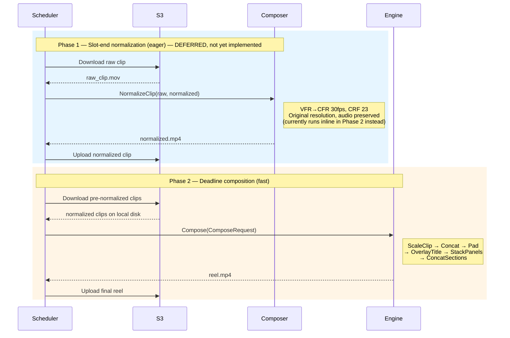

# FFmpeg Engine Architecture

## 1. Package Structure

Two-layer design: **Engine** (orchestration) wraps **Composer** (FFmpeg primitives).



---

## 2. Engine.Compose Pipeline

Full orchestration flow from `ComposeRequest` to final `reel.mp4`.



---

## 3. Two-Phase Pipeline

How the engine fits into the larger system. Phase 1 runs eagerly at slot-end; Phase 2 runs at deadline.



---

## 4. Panel Layouts

`PanelDimsFor(n)` output by participant count. All reels are portrait 720×1280.

```
1 participant        2 participants       3 participants       4 participants
720×1280             720×640 each         720×427 each         360×640 each

┌──────────┐         ┌──────────┐         ┌──────────┐         ┌─────┬─────┐
│          │         │  Player  │         │ Player A │         │  A  │  B  │
│          │         │    A     │         ├──────────┤         │     │     │
│  Player  │         ├──────────┤         │ Player B │         ├─────┼─────┤
│    A     │         │  Player  │         ├──────────┤         │  C  │  D  │
│          │         │    B     │         │ Player C │         │     │     │
│          │         └──────────┘         └──────────┘         └─────┴─────┘
└──────────┘

Layout: single       Layout: vstack       Layout: vstack×3     Layout: 2×2 grid
```

---

## 5. Composer Method → FFmpeg Command Mapping

| Method | FFmpeg command | Key flags | Phase |
|---|---|---|---|
| `NormalizeClip` | `ffmpeg -i input -vf fps=30 -c:v libx264 -crf 23 -c:a aac` | VFR→CFR, preserves audio | 1 |
| `ScaleClip` | `ffmpeg -i input -vf scale=W:H -c:v libx264 -crf 23 -c:a copy` | Re-encode video, copy audio | 2 |
| `GenerateBlackPanel` | `ffmpeg -f lavfi -i color=black -f lavfi -i anullsrc -t D` | Synthetic sources | 2 |
| `OverlayTitle` | `ffmpeg -i input -vf "drawtext=text='...':x=(w-text_w)/2:y=(h-text_h)/2"` | Requires libfreetype; symlinks on fallback | 2 |
| `StackPanels` | `ffmpeg -i p0 -i p1 ... -filter_complex "vstack\|hstack"` | `buildFilterGraph(n, audioIdx)` | 2 |
| `ConcatSections` | `ffmpeg -f concat -safe 0 -i list.txt -c copy` | Lossless concat | 2 |
| `Probe` | `ffprobe -print_format json -show_streams` | Duration, dims, audio detect | both |

---

## 6. Audio Rotation

One participant's audio is kept per section; all others are silenced.

```
audioIdx = sectionIdx % len(participants)
```

For a 2-participant, 4-section reel:

| Section | audioIdx | Audio from |
|---------|----------|------------|
| 0 | 0 | Alice |
| 1 | 1 | Bob |
| 2 | 0 | Alice |
| 3 | 1 | Bob |
